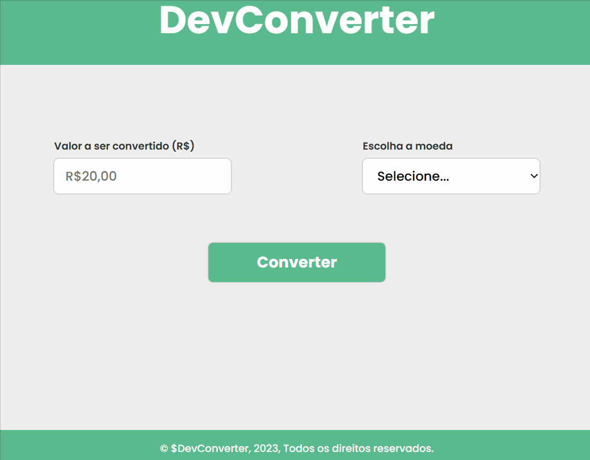

# DEVCONVERTER
💰 Um projeto de converter Real para Dólar ou Euro, com valores já fixados baseados na cotação do dia 16/05/2023, caso o valor não seja digitado ou o tipo de moeda não for selecionado, irá aparecer uma mensagem de alerta, com um arquivo README.💰

[]

## Tecnologias utilizadas ⚡
- HTML
- CSS
- JavaScript